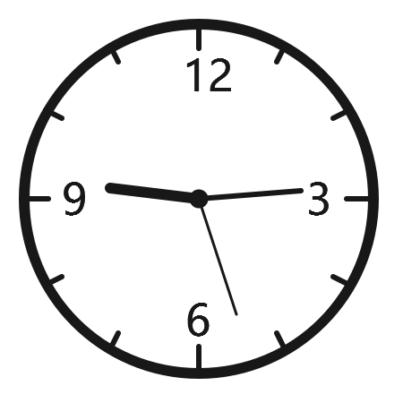
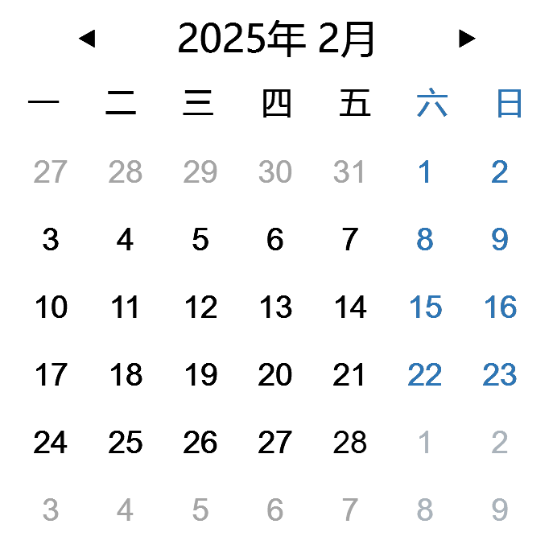
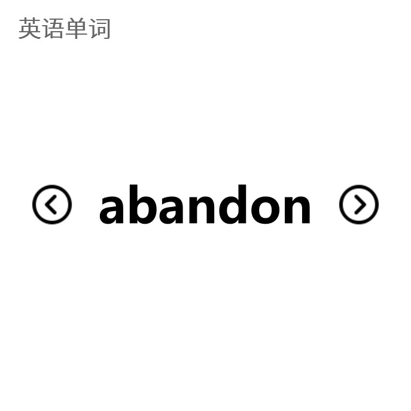

---
# https://vitepress.dev/reference/default-theme-home-page
layout: home

hero:
  name: "灵卡面板"
  tagline: 灵动卡片，打造你的专属工具面板
  image:
    src: /background.png
    alt: 背景图
  actions:
    - theme: brand
      text: 下载
      link: http://localhost:5173/background.png
    - theme: alt
      text: 开发者文档
      link: /api-examples

features:
  - icon: ✨
    title: 海量卡片
    details: 各种尺寸，自由组合，组合出独属于你的灵卡面板。卡片持续添加中...
  - icon: 🚀
    title: 效率
    details: 不管是快捷键还是鼠标，均可快速呼出灵卡面板。结束使用后，鼠标移出灵卡面板即可自动隐藏
  - icon: 🐟
    title: 摸鱼
    details: 内置各种有趣卡片和游戏，让你时时刻刻轻松摸鱼
  - icon: 🛠
    title: 工具
    details: 包含编程、音乐、学习、运动、影视等各个领域的卡片和工具
  - icon: 🧩
    title: 可拓展
    details: 开发者可依照开发文档设计卡片并提交，等待审核通过即可让所有用户使用
  - icon: 🧙
    title: 多形态
    details: 多重形态随心变，可以是从侧边弹出的灵卡面板，也可以是悬浮在桌面上的灵卡面板
---

<!------------ 主页卡片滚动 ------------>
<section class="home-widget">
    

            <h1 data-v-e0f7ef84="">卡片式小组件，好看又好用</h1><em style="background-color:#ffdd12;" class="title-bg"
                data-v-e0f7ef84=""></em>
        
        

            海量组件，免费使用。多种尺寸任意调节，令你的桌面独具一格
        

    

    

        

            

                

                

                    
                    
                    
                    
                    
                    
                    
                    
                    
                    
                

                

                    
                    
                    
                    
                    
                    
                    
                    
                    
                    
                

            

            

                

                

                    
                    
                    
                    
                    
                    
                    
                    
                    
                    
                

                

                    
                    
                    
                    
                    
                    
                    
                    
                    
                    
                

            

            

                

                

                    
                    
                    
                    
                    
                    
                    
                    
                    
                    
                

                

                    
                    
                    
                    
                    
                    
                    
                    
                    
                    
                

            

        

    

</section>